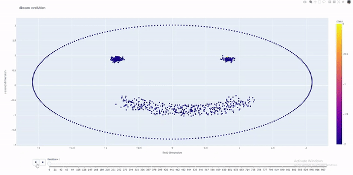

# Clustering From Scratch

### Playground project with four clustering algorithms that can be applied to tabular data

This project represents a playground for testing, optimizing, comparing and visualizing four clustering algorithms. It includes KMeans, DBSCAN, Gaussian Mixture and Agglomerative Clustering methods which are implemented in Python. In addition, there are developed various distance metrics to offer variety and clustering scores to evaluate the quality of the results. 

## Features

- Two main modes:
  - optimizes each algorithm for one data set and picks the best method
  - runs each algorithm on one data set and displays the results
- Includes data processing and dimensionality reduction for visualization
- Implements distances like Euclidean, Manhattan, Cosine similarity and Pearson correlation
- Incorporates automated optimization process for each algorithm
- Implements quality scores such as WSS, Rand Index and Purity
- Generates animations of the clustering process
- Offers testing capabilities for KMeans versus the version from Scikit-learn

## Animation

The evolution of the DBSCAN algorithm run on the smile data set

## License

[GNU GPLv3](https://choosealicense.com/licenses/gpl-3.0/)
